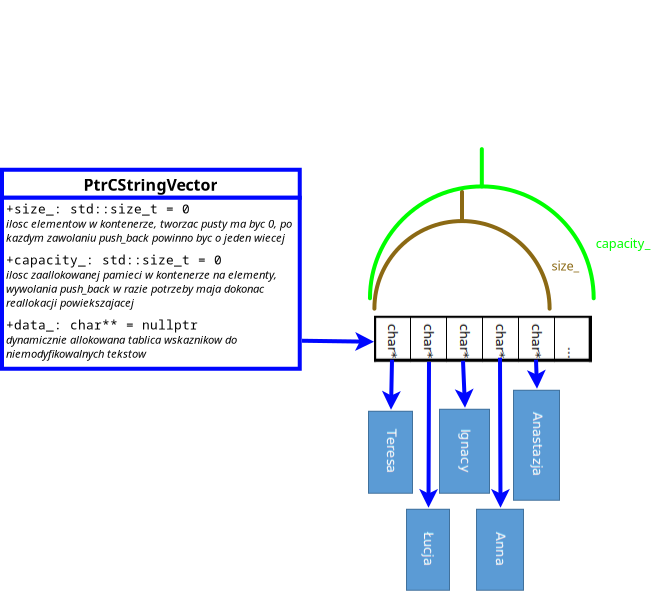

# Laboratoria 10: Kolokwium z roku 2021: PtrCStringVector
Materiał w tym roku jest podobny co w roku 2021, więc samodzielne zrobienie paczki daje duże szanse na zdanie tegorocznego kolokwium.
Proszę spróbować zaimplementować to w oparciu o treść z pliku `PtrCStringVector.h`
(alternatywnie w pliku `Documentation.pdf`)..

**Dobrze jakby Państwo spróbowali to kolokwium zrobić zamodzielnie, nie pytali się zbyt pochopnie innych. Jeśli Państwo sobie poradzą będzie to znak, że materiał na kolokwium w aktualnym roku Państwo w miarę ogarniają.**

**Sugeruję zrobić na jedno posiedzenie całą paczkę, licząc czas. Jeśli się komuś uda w dwie godziny wszystko, tzn. że jest na poziomie najlepszych osób sprzed dwóch lat.**

W razie problemów z długim oczekiwaniem na wynik - proszę nie robić alokacji o jeden więcej niż ma się aktualnie - dynamiczna alokacja jest droga, dlatego starajmy się jej unikać!

## Omówienie paczki:
O co chodzi w tym zadaniu znajduje się w krótkim [nagraniu](https://banbye.com/watch/v_r7wajtKuv3nG).

## Dodatkowe wymagania:
Dla osób, którym się uda doprowadzić do sytuacji, że wszystkie testy przejdą proponuję dorobić następujące rzeczy:
1. Iterator (1/2 punkta z aktywności za zaimplementowanie + 1/2 punkta z aktywności za testy do tego)

____________________________________________________________________________________
## Podpięte narzędzia przy sprawdzaniu (wyniki w katalogu `logs/`):
1. `cppcheck` - narzędzie do statycznej analizy kodu, które analizuje kod i szyka potencjalnych błędów (statyczny analizator może się pomylić)
2. `flawfinder` - narzędzie do statycznej analizy kodu pod względem podatności kodu pod względem bezpieczeństwa
3. `perf` (`perf stats` i `perf record`), narzędzie do zaawansowanego monitorowanania wykonywania programu, można zarówno podejrzeć szczegóły wykonania (`perf stats`), jak i prześledzić ile czasu program spędził w danej funkcji (`perf record`). W oparciu o wynik tej drugiej komendy można prześledzić w sposób interaktywny w [programie hotspot](https://github.com/KDAB/hotspot), natomiast można też wygenerować grafikę w oparciu o [brendangregg/Flamegraph](https://github.com/brendangregg/Flamegraph.git).
4. `cpplint` - narzędzie do statycznej analizy kodu, autorstwa firmy Google, które znajduje różne rzeczy do poprawy (również aspekty związane ze stylem programowania)
5. `clang-tidy` - narzędzie do analizy kodu bazujące na kompilatorze, służy jako backend w wielu środowiskach programistycznych znajdując błędy na bieżąco. Narzędzie to raczej się nie myli (ma pod spodem kompilator), chociaż może być bardziej restrykcyjne niż aktualnie używany kompilator.
6. Wykrywanie tabów w plikach - zła praktyka aby umieszczać znaki tabulacji w plikach źródłowych z C++. A także narzędzie do wykrywania tzw. trailing whitespaces - czyli białych znaków na końcu linii. Robię to jako skrypty bashowe.

